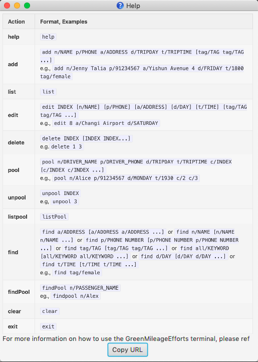
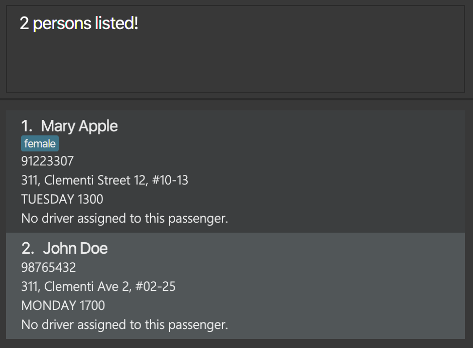

GreenMileageEfforts (GME) is a platform that helps drivers and passengers of any IT company quickly arrange carpooling in order to lower their carbon footprint. The platform follows that of a command-line interface (CLI) such that power users that are familiar can efficiently navigate the program.

* Table of Contents
{:toc}

--------------------------------------------------------------------------------------------------------------------

# Quick start

1. Ensure you have java 11 or above installed in your computer
2. Download the latest `GreenMileageEfforts.jar` from [here](https://github.com/AY2021S2-CS2103T-W10-1/tp/releases)
3. Copy the file to the folder you want to use as the *home* folder for your **GreenMileageEfforts**.
4. Double click the file to start the app.
5. Type the command in the command box and press `Enter` to execute it
6. Refer to the [Features]() below for the details on each command.

--------------------------------------------------------------------------------------------------------------------

## Features

**:information_source: Notes about the command format:** 

* Words in `UPPER_CASE` are the parameters to be supplied by the user. 
  e.g. in `add n/NAME`, `NAME` is a parameter which can be used as `add n/John Doe`.

* Items in square brackets are optional. 
  e.g `n/NAME [t/TAG]` can be used as `n/John Doe t/friend` or as `n/John Doe`.

* Items with `…`​ after them can be used multiple times including zero times. 
  e.g. `[t/TAG]…​` can be used as ` ` (i.e. 0 times), `t/friend`, `t/friend t/family` etc.

* Parameters can be in any order. 
  e.g. if the command specifies `n/NAME p/PHONE_NUMBER`, `p/PHONE_NUMBER n/NAME` is also acceptable.

* If a parameter is expected only once in the command but you specified it multiple times, only the last occurrence of the parameter will be taken. 
  e.g. if you specify `p/12341234 p/56785678`, only `p/56785678` will be taken.

* Extraneous parameters for commands that do not take in parameters (such as `help`, `list`, `exit` and `clear`) will be ignored. 
  e.g. if the command specifies `help 123`, it will be interpreted as `help`.

### Viewing help : `help`

Shows a message explaning how to access the help page.

Format: `help`

### Create passengers: `create`

Creates a new passenger in the GME terminal.

Format: `create n/NAME a/ADDRESS t/TIME`

>**Examples**:
>* `create n/Ben Dover a/Geylang t/18:00`

### Listing all passengers : `list`

Lists the passengers currently stored in the GME terminal.

Format: `list`

### Search for passengers: `search`

Search passengers according to the constraints such as looking for female driver only or if they are available

Format: `search CONSTRAINT`

* Only one criteria can be search at a time
* List of constraints that can be searched includes:
  *availability*, *gender*

> **Examples**:`search female` or `search available`

### Locating persons by name: `find`

Finds persons whose names contain any of the given keywords.

Format: `find KEYWORD [MORE_KEYWORDS]`

* The search is case-insensitive. e.g `hans` will match `Hans`
* The attribute searched is defined by the same prefixes used for adding people.
* Only full words will be matched e.g. `Han` will not match `Hans`
* Only one keyword and one type of prefix can be specified
* Keywords separated by space will require both keywords to be matched.
  e.g. `Hans Yang` will only return `Hans Gruber Yang` instead of `Bo Yang`
* Prefixes for searching name `n/`, address `a/`, tag `tag/`, phone number `p/`

>**Examples**:
>* `find n/John` returns `john` and `John Doe`
>* `find a/Clementi` returns `John Doe`, `Mary Apple` 
  

### Delete passengers: `delete`

Deletes the specific passenger from the GME terminal.

Format: `delete INDEX`

* Deletes the person at the specified `INDEX`.
* The index refers to the index number shown in the displayed person list.
* The index **must be a positive integer** 1, 2, 3, …​
* `search female` followed by `delete 3` deletes the *1st* person in the results of `search female` command

> **Examples:
-** `list` followed by `delete 3` deletes the *3rd* person in the address book

### Select passengers to be driven: `drive`

Selects passengers from the current view in the GME terminal.

Format: `drive INDEX [INDEX INDEX...]`

* The order of the passengers' index does not matter
* The maximum number of passengers that can be selected at once is 6
* You can select between 1 to 6 people to drive with one command

>**Examples**:
>* `search female` followed by `drive 2 3 4` selects the the *2nd*, *3rd* and *4th* person in the results of `search female` command

### Clearing all entries : `clear`

Clears all entries from the address book.

Format: `clear`

### Exiting the program : `exit`

Exits the program.

Format: `exit`

### Saving the data

GME data are saved in the hard disk automatically after any command that changes the data. There is no need to save manually.

### Editing the data file

GME data are saved as a JSON file `[JAR file location]/data/GreenMileageEfforts.json`. Advanced users are welcome to update data directly by editing that data file.

### Archiving data files `[coming in v2.0]`

_Details coming soon ..._

--------------------------------------------------------------------------------------------------------------------

# FAQ

**Q:** Where can I find the data stored by the address book?

**A:** The json file containing the data stored is named `GreenMileageEfforts.json` and can be found in the `../data` folder, where `..` is the path to your `GreenMileageEfforts.jar` file.

--------------------------------------------------------------------------------------------------------------------

## Command summary

Action | Format, Examples
--------|------------------
**create** | `create n/NAME a/ADDRESS t/TIME`   e.g., `create n/Mike Hunt a/Geylang t/18:00`
**list** | `list`
**search** | `search CONSTRAINT`  e.g., `search female or search available`
**delete** | `delete INDEX`  e.g.,`delete 3`
**drive** | `drive INDEX INDEX INDEX...`  e.g., `drive 2 3 4`
**find** | `find a/ADDRESS` or `find n/NAME` or `find p/PHONE NUMBER` or `find tag/TAG`   e.g., `find tag/female`
